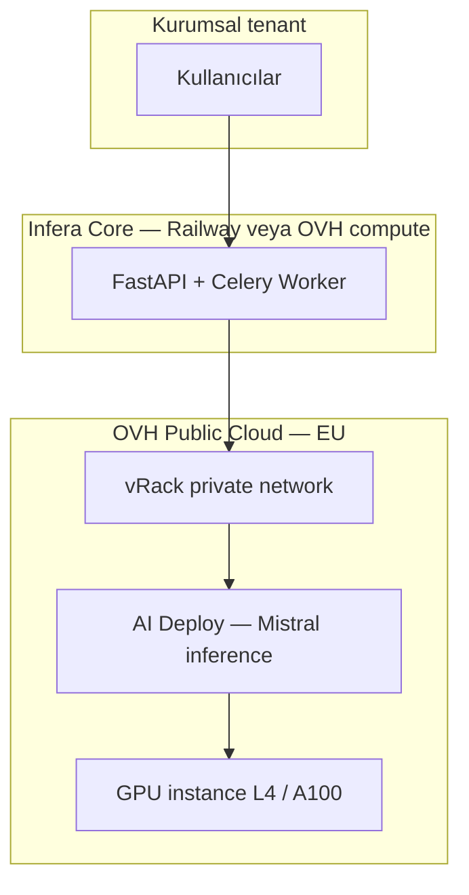

# OVH Mistral Roadmap — Şirket İçi Güvenli LLM

**Kaynak:** Ana ürün backlog'undan bilinçli olarak ayrı tutulur.  
**Ana roadmap:** [`roadmap.md`](roadmap.md) — bölüm *Ayrı Roadmap — OVH Mistral*  
**Referans:** [OVHcloud Public Cloud — AI & Machine Learning](https://www.ovhcloud.com/de/public-cloud/ai-machine-learning/)

## Kapsam

Infera RCA motorunun **kurumsal / KVKK-strict** müşterilerde OpenRouter (Haiku/Flash) yerine **OVH Public Cloud üzerinde tenant-scoped Mistral inference** ile çalışması.

| Bu roadmap kapsar | Ana `roadmap.md` kapsar |
|-------------------|-------------------------|
| OVH AI Deploy / AI Endpoints kurulumu | OpenRouter tabanlı shared SaaS |
| Mistral model seçimi ve GPU ops | HITL, rapor, token, e-posta, panel |
| `llm_backend=ovh_mistral` provider katmanı | P0–P2 ürün özellikleri |
| vRack, egress guard, kurumsal onboarding | Genel güvenlik (P1.18) |

**Ürün ilkesi:** Agent pipeline, HSG245 taksonomisi, rapor iskeleti ve HITL akışı **tek kod tabanında sabit** kalır. Yalnızca LLM provider uç noktası değişir.

**Ana roadmap bağlantıları:** P1.9 (model stratejisi), P1.17 (multi-tenant / dedicated deploy), P1.18 (veri egresyonu ve audit).

## Neden OVH + Mistral?

| Gereksinim | OVH karşılığı |
|------------|----------------|
| Veri egresyonu kontrolü | Prompt/cevap OpenRouter dışına çıkmaz; EU bölge (örn. `GRA` / `DE`) |
| Şirket içi / izole erişim | **vRack** — GPU inference ↔ API/worker private backbone |
| Üretim inference | **AI Deploy** — model container + HTTPS/gRPC API endpoint |
| Hızlı POC / yönetilen katalog | **AI Endpoints** — OpenAI-uyumlu API (Early Access) |
| Fine-tune (ileride) | **AI Training** + **AI Notebooks** — tenant LoRA / ABS-HSE dataset |
| Uyumluluk mesajı | OVH compliance, encryption, DDoS; kurumsal müşteri dokümantasyonu |

## Alternatif GPU platformları (not — sonra bak)

Kurumsal üretim için **OVH (EU + vRack + compliance)** öncelikli. Aşağıdakiler **POC, dev, maliyet kıyaslaması** veya geçici inference için not; henüz karar yok.

| Platform | Link | Özet | Tipik GPU / fiyat (yaklaşık) | Artı | Eksi |
|----------|------|------|------------------------------|------|------|
| **RunPod** | [runpod.io](https://www.runpod.io) | AI geliştiriciler arasında yaygın; geniş GPU kataloğu | L4, RTX 4090, A100; L4 ~**$0.30–0.40/saat** | Pod (SSH) **ve** serverless (saniye bazlı ödeme); hızlı başlangıç | EU/KVKK ve kurumsal SLA OVH kadar net değil; bölge seçimi dikkat |
| **Vast.ai** | [vast.ai](https://vast.ai) | Marketplace — dünya geneli boş GPU’lar | L4, RTX 4090; çok düşük saatlik fiyatlar | En ucuz seçeneklerden biri; esnek | Host güvenilirliği değişken; kurumsal müşteriye zor satış; veri lokasyonu dağınık |
| **Lambda Labs** | [lambdalabs.com](https://lambdalabs.com) | Doğrudan deep learning odaklı | L40S, H100, A10G; iyi fiyat/performans | Popüler, DL-native stack | **Stok** — boş sunucu bulmak zor olabiliyor |
| **Brev.dev** | [brev.dev](https://brev.dev) | Hızlı model deploy arayüzü | Arka planda ucuz GPU sağlayıcıları birleştirir | Deploy UX iyi; POC hızlı | Multi-provider = veri yolu karmaşık; kurumsal audit zor |

**Kısa notlar:**

- **RunPod:** Pod = klasik VM + SSH; Serverless = cold start + kullandığın kadar öde — Infera worker’dan OpenAI-uyumlu endpoint açmak için POC’de en pratik adaylardan biri.
- **Vast.ai:** Fiyat avcılığı için iyi; production / KVKK için host ve bölge due diligence şart.
- **Lambda Labs:** Büyük model (H100) denemeleri; availability takip et.
- **Brev.dev:** “Hızlı dene” katmanı; uzun vadeli tek sağlayıcı olarak değil, aggregator olarak düşün.

**OVH vs alternatifler (ürün kararı taslağı):**

| Senaryo | Öneri |
|---------|--------|
| Kurumsal müşteri, KVKK, “veri AB’de” | **OVH** |
| İç POC, maliyet testi, Mistral latency | RunPod veya Vast.ai |
| Fine-tune / büyük GPU denemesi | Lambda Labs (stok varsa) |
| 1 günlük deploy denemesi | Brev.dev |

⏳ M0 öncesi: en az 2 alternatifte (ör. RunPod + OVH) aynı Mistral prompt ile maliyet/latency tablosu.

## Hedef mimari

## Dağıtım modelleri

| Mod | Kim için | Inference |
|-----|----------|-----------|
| **Shared SaaS (bugün)** | Starter / demo | OpenRouter — ana roadmap |
| **Dedicated Mistral (bu roadmap)** | Kurumsal / KVKK-strict | OVH AI Deploy + Mistral; `tenant_config.llm_backend=ovh_mistral` |
| **Full dedicated stack** | Enterprise | API + worker + Mongo aynı OVH projesi; vRack-only LLM (P1.17) |

## Mistral hedefleri (ürün kararı)

- **MVP inference:** `mistral-small` veya `Mixtral-8x7B-Instruct` (maliyet / latency).
- **Yüksek kalite rapor:** `mistral-large` veya güncel Mistral instruct (DOCX/HTML).
- **Deployment:** AI Deploy (vLLM / TGI / OVH template) veya AI Endpoints Mistral slug — POC sonrası netleştir.

---

## M0 — Keşif ve POC (ops + mimari)

- ⏳ OVH hesap / proje; EU bölge; GPU kotası ve fiyatlandırma onayı.
- ⏳ [AI Deploy](https://www.ovhcloud.com/de/public-cloud/ai-machine-learning/) ile Mistral deploy POC — latency, token/s, maliyet/rapor.
- ⏳ AI Endpoints katalogunda Mistral doğrula; `/v1/chat/completions` ile mevcut client uyumu test et.
- ⏳ vRack: inference endpoint yalnızca Infera worker / private subnet’ten erişilebilir.

**Acceptance (M0):** Tek incident metni ile chat completion; ortalama latency ve maliyet/rapor tablosu.

---

## M1 — Provider abstraction (kod)

- ⏳ `agents/model_constants.py` — `LLM_BACKEND=openrouter|ovh_mistral`.
- ⏳ Env: `OVH_AI_ENDPOINT_URL`, `OVH_AI_ACCESS_TOKEN`, `OVH_MISTRAL_ANALYSIS_MODEL`, `OVH_MISTRAL_REPORT_MODEL`.
- ⏳ OpenAI-compatible adapter; analiz + rapor model slug’ları `tenant_config`’ten.
- ⏳ `tenant_config`: `llm_backend`, `ovh_mistral_analysis_model`, `ovh_mistral_report_model`, `allow_openrouter_fallback` (kurumsal varsayılan **false**).
- ⏳ Pipeline / HITL / DOCX provider seçimi; usage ledger `provider=ovh_mistral`.

**Acceptance (M1):** Feature flag ile tek tenant Mistral backend’e yönlendirilir; shared tenant etkilenmez.

---

## M2 — Güvenlik ve operasyon

- ⏳ **Egress guard:** `llm_backend=ovh_mistral` iken incident metni OpenRouter’a **asla** gitmez (startup + runtime + test).
- ⏳ TLS 1.3 inference ↔ worker; model weights at-rest OVH encrypted storage.
- ⏳ Audit: LLM metadata (token, model, tenant); prompt içeriği loglanmaz veya redacted.
- ⏳ Health: `ovh_mistral_reachable`; worker startup diagnostic (P0.4 pattern).
- ⏳ Runbook: restart, scale-to-zero, key rotation, kontrollü OpenRouter fallback (tenant onayı + audit).

**Acceptance (M2):** Network/provider audit — veri yalnızca OVH endpoint; regresyon test CI’da.

---

## M3 — Kurumsal paket ve satış

- ⏳ Onboarding checklist: OVH proje + vRack + Mistral + smoke (form → HITL → rapor).
- ⏳ Müşteri dokümantasyonu: “Veriler AB/EU OVH’de kalır; LLM inference size ayrılmış endpoint’tir.”
- ⏳ (Opsiyonel) AI Training + P1.2 DSPy artifact fine-tune.

**Acceptance (M3):** Yeni kurumsal tenant ≤ 1 iş günü onboarding (kod deploy gerektirmez).

---

## Env / config

| Değişken / alan | Açıklama |
|-----------------|----------|
| `LLM_BACKEND` | `openrouter` (varsayılan) \| `ovh_mistral` |
| `OVH_AI_ENDPOINT_URL` | AI Deploy / AI Endpoints base URL |
| `OVH_AI_ACCESS_TOKEN` | Bearer token (OVH IAM / endpoint key) |
| `OVH_MISTRAL_ANALYSIS_MODEL` | Örn. `mistral-small-latest` |
| `OVH_MISTRAL_REPORT_MODEL` | Örn. `mistral-large-latest` |
| `tenant_config.llm_backend` | Tenant override |

## Genel acceptance

- Kurumsal tenant’ta tam pipeline **OpenRouter çağrısı olmadan** tamamlanır.
- Shared SaaS OpenRouter varsayılan kalır.
- Mistral down + fallback kapalı → kontrollü 502; fallback açık → audit kaydı.
- POC raporu: rapor başına süre + GPU saat maliyeti arşivlenir.

## İlgili dosyalar

`agents/model_constants.py`, `agents/rootcause_agent_v3_1.py`, `agents/hitl_question_service.py`, `agents/skillbased_docx_agent.py`, `shared/usage_context.py`, `shared/token_account.py`, `tasks/pipeline_tasks.py`
