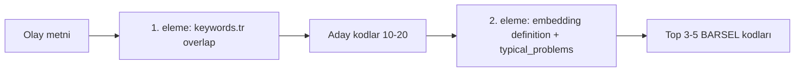
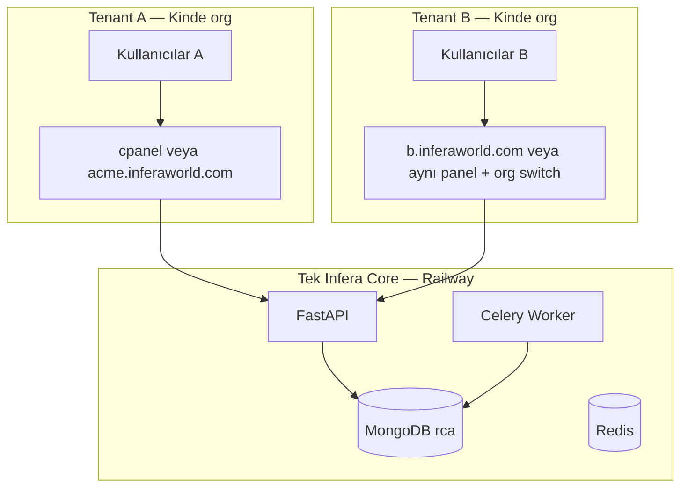
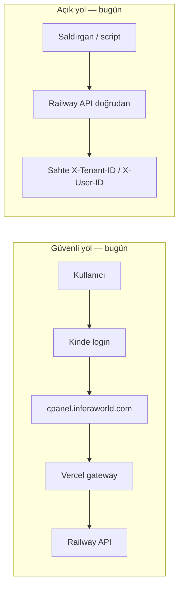

# Execution Roadmap

Source: synchronized from root `TODO.md`.

## P0 (Critical)

### P0.1 Multi-Tenant User Management

- ⏳ Persistent tenant/user registry in Redis.
- ⏳ Admin tenant and user management APIs.
- ⏳ Role-based authorization on pipeline and incident operations.
- ⚠️ Frontend tenant header propagation. (PARTIAL - tenant headers are used in API client paths, but end-to-end/user-role model is not fully completed yet)

### P0.2 5-Step Incident-Specific HITL

- ✅ Add LLM-driven incident-specific HITL question generator. (DONE - `agents/hitl_question_service.py` with `_llm_question_candidates`)
- ✅ Remove generic first-step prompts; start with incident summary + analysis notice. (DONE)
- ✅ After first immediate-cause stage, generate deeper selectable questions from `agents/knowledge_base.py`. (DONE - taxonomy/KB-backed probes)
- ✅ Fallback from static logic to LLM by quality threshold. (DONE - hybrid static + LLM candidate flow)
- ✅ HITL answer UX: `free_text`, `yes_no_unknown`, choice chips; hybrid optional text under Yes/No; auto-advance on chip click or Enter (`hitlResponseMode.js`, `ChatInterface.jsx`). (DONE)
- ✅ Backend `response_mode` inference for open questions (kaç/deneyim/miktar/listele — not forced to yes/no) (`agents/hitl_question_service.py`). (DONE)
- ⚠️ Improve Why-chain continuity. (PARTIAL — answer handling done; branch flow still iterative)
- ⏳ Persist HITL logs for training reuse.
- ✅ Keep a single primary large-area frontend analysis flow (remove duplicated secondary Why widgets). (DONE)
- ✅ Show initial immediate causes without taxonomy codes in chat intro, then switch directly to deep-dive collaboration prompts. (DONE)
- ✅ Filter out generic/duplicative HITL questions already covered by manual form fields (timeline/training/PPE/weather/lighting). (DONE)
- ✅ Generate Why-probe questions from taxonomy code semantics (choose-if/not-this-if) before generic gap questions. (DONE - taxonomy-first probe)

### P0.3 Frontend Live Streaming

- Branch/why-level granular progress callbacks.
- ✅ Enriched job payload: Celery `activity_lines` + `latest_activity` on pipeline jobs (`shared/pipeline_progress.py`, `rootcause_agent_v3_1.py`, `tasks/pipeline_tasks.py`, `api/main.py` `_normalize_celery_job`). (DONE)
- ✅ Chat UI streams pipeline activity + final RCA summary after HITL (`ChatInterface.jsx`, `formatPipelineChat.js`; WebSocket/polling `onUpdate`). (DONE)
- ⏳ Live timeline component in chat UI (dedicated stepper beyond bullet list).
- ⏳ WebSocket reconnect and robust failure UX.
- ✅ Increase frontend pipeline timeout defaults from 6 minutes to 20 minutes for polling/WebSocket job tracking to reduce premature "Pipeline timeout (360s)" errors on long RCA runs. (DONE)

### P0.4 Worker OpenRouter 401 Stabilization

- ✅ Eliminate `Missing Authentication header` failures in Step 3 (Celery worker). (DONE)
- ✅ Enforce deploy/runtime parity between API and worker services. (DONE - runtime OpenRouter diagnostics + shared worker startup script)
- ✅ Add deterministic startup diagnostics for auth/debug visibility. (DONE - OpenRouter worker config + UTC startup logs)
- ✅ Verify worker is running latest commit via build fingerprint and deploy metadata. (DONE - `celery_app.WORKER_BUILD_TAG` startup log)
- ✅ Add clear runbook for Railway redeploy + env parity checks. (DONE - operationalized through worker script/env conventions in repo docs)
- Acceptance:
  - Worker logs show build fingerprint and OpenRouter runtime config on startup.
  - HITL flow reaches Part 3+Part 4 completion without OpenRouter 401.
  - Same env/config behavior is reproducible after restart and redeploy.

### P0.5 Worker Burst Scaling Without Always-On High Load

- ✅ Configure Celery worker autoscaling for burst traffic. (DONE)
- Default runtime profile:
  - ✅ `CELERY_POOL=prefork` (DONE)
  - ✅ `CELERY_AUTOSCALE_MAX=5` (DONE)
  - ✅ `CELERY_AUTOSCALE_MIN=1` (DONE)
- ✅ Keep baseline resource usage low while allowing temporary parallel RCA jobs. (DONE - autoscale min/max + prefetch baseline)
- Acceptance:
  - Idle worker runs at min process count.
  - Under queue pressure worker scales up to configured max.
  - Scale-down occurs automatically after queue drains.

### P0.6 Action Plan JSON Robustness

- ✅ Enforce stricter Action Plan JSON schema validation. (DONE - schema gate in `ActionPlanAgent`)
- ✅ Add retry and \"json-only\" sanitizer parser for malformed outputs. (DONE - 3-attempt regeneration + sanitize candidates)
- ✅ Sanitize markdown fences and trailing commas before parsing. (DONE - candidate sanitizer in `ActionPlanAgent`)
- ✅ Add parse telemetry and malformed-output regression tests. (DONE - telemetry logs + `tests/test_actionplan_json_hardening.py`)

### P0.7 Celery Long-Run Reliability

- ✅ Keep `prefork + autoscale` as baseline worker runtime. (DONE)
- ✅ Tune heartbeat and broker visibility timeout for long RCA tasks. (DONE - env-driven visibility timeout + health interval + prefetch=1)
- ✅ Reduce single-worker CPU blocking with staged checkpoints. (DONE - cooperative progress checkpoints in `tasks/pipeline_tasks.py`)
- ✅ Add 3-5 parallel-run reliability/load validation and ops visibility. (DONE - ops summary in `shared/ops_celery.py` + `tests/test_parallel_rca_load_scenario.py`)
- ✅ Add worker recycle and runtime UTC diagnostics to reduce long-lived process degradation and make clock-drift triage explicit (`CELERY_MAX_TASKS_PER_CHILD`, startup UTC log in `celery_app.py` + worker start script). (DONE)
- ✅ Expose action-plan fallback telemetry in pipeline progress/result payload (`actionplan_meta.fallback_used`) for easier RCA/report quality triage. (DONE - `tasks/pipeline_tasks.py`)
- ⚠️ Remaining ops prerequisite: platform-level clock sync/NTP parity across worker instances (code cannot force host clock; monitor for `Substantial drift ... clocks are out of sync`). (OPS NOTE)

### P0.8 Multilingual Report + Interactive UX Stream

- ✅ Propagate selected frontend language to investigate/report pipeline (`output_language`). (DONE)
- ✅ Ensure report shell labels (DOCX + HTML) follow selected language (minimum: non-TR must not render Turkish headers). (DONE - baseline)
- ✅ Align report visual palette with admin panel theme tokens. (DONE)
- ✅ Interactive analysis must open chat-first and show active chatbot surface immediately. (DONE)
- ✅ Fast HITL bootstrap: `POST /assessment/form` (no LLM) before chat tab — avoids stuck “Assessment calisiyor” on interactive submit (`api/main.py`, `RcaFrontendHub.jsx`, gateway `add_assessment_form`). (DONE)
- ✅ Stream live root-cause/progress lines in Agent Pipeline area during analysis/report generation. (DONE)
- ✅ HITL intro: stream per-incident immediate causes (“doğrudan nedenler belirleniyor…”) instead of static list (`streamHitlIntro.js`, `deriveImmediateCauseLines`). (DONE)
- ✅ Lock **Etkileşimli Analiz** tab until Manuel Form → **Etkileşimli Analize Geç**; block free `sendMessage` chat (timeout path removed). (DONE — `RcaFrontendHub.jsx`, `ChatInterface.jsx`)
- ✅ Post-HITL pipeline lines in chat message (worker progress → UI via `activity_lines`). (DONE — see P0.3)
- ✅ Interactive **HTML Oluştur** flow: no blank-popup requirement; download-first + preview/tab/blob fallback (`ChatInterface.jsx`, `hsg245Api.js`). (DONE)
- ✅ Report generation tolerates Part 3 / artifact write delay (frontend retry + API `_generate_report_artifacts` retry). (DONE)

### P0.9 Report Template, Branding, and Hologram

- ✅ `shared/report_layout_config.py` — tek kaynak bölüm modeli, `show_technical_codes`, logo URL, watermark (`draft|final|none`). (DONE)
- ✅ `SkillBasedDocxAgent` + `_generate_report_artifacts` layout snapshot; HTML watermark + kapak logosu. (DONE)
- ✅ `format_report_text` / `set_report_text_policy` — teknik kod görünürlüğü tenant/rapor bayrağına bağlı. (DONE)
- Hedef: rapor çıktısını kurumsal, tutarlı ve denetlenebilir hale getirmek (DOCX + HTML aynı içerik modeli).
- Çözüm:
  - Tek kaynak şablon modeli (`report_layout_config`) tanımla: kapak, bölüm sırası, görünür alanlar.
  - DOCX/HTML renderer'ları aynı bölüm sözlüğünden beslensin; renderer'a özel hardcode metin kaldır.
  - Teknik kod alanları için `show_technical_codes` bayrağı ekle (tenant default + rapor override).
  - Logo politikası: tenant seviyesi varsayılan logo + rapor bazlı geçici override.
  - Draft/final ayrımı için watermark katmanı (`DRAFT`, `FINAL`) ve görünürlük kuralları.
- Teslim kriterleri:
  - Aynı incident için DOCX ve HTML bölüm başlıkları/sırası birebir uyumlu.
  - "Teknik kodları gizle" seçildiğinde kullanıcıya dönük raporda kodlar görünmez.
  - Logo/watermark tenant kuralına göre deterministik uygulanır.

### P0.10 User Report Library + Completion Email Delivery

- ✅ `report_deliveries` koleksiyonu + idempotency (`delivery_key`). (DONE)
- ✅ Celery `send_report_delivery_email` + imzalı indirme linkleri (`signed_links`, `GET /api/v1/reports/delivery/download`). (DONE)
- ✅ Rapor hazır e-postası: `library_finalize`, `POST /reports/html`, `library/save-html` sonrası kuyruk. (DONE)
- ✅ E-posta dili: `output_language` (TR/EN) — konu + gövde (`shared/report_delivery_email.py`). (DONE)
- ✅ HTML rapor **e-posta eki** (`{incident_id}_report.html`); DOCX imzalı link opsiyonel. (DONE)
- ✅ Dashboard: teslimat zaman çizelgesi + SMTP durumu (`GET /api/v1/deliveries`). (DONE)
- ⚠️ SMTP ortam değişkenleri yapılandırılmadan e-posta gönderilmez; Celery worker gerekir. (OPS)

#### E-posta kurulum rehberi (Railway / production)

| Değişken | Örnek | Açıklama |
|----------|-------|----------|
| `SMTP_HOST` | `smtp.gmail.com` veya `smtp.sendgrid.net` | SMTP sunucusu |
| `SMTP_PORT` | `587` | TLS portu (465 SSL alternatif) |
| `SMTP_USER` | `reports@inferaworld.com` | SMTP kullanıcı adı |
| `SMTP_PASSWORD` | `***` | Uygulama şifresi / API key |
| `SMTP_FROM` | `Infera Raporlar <reports@inferaworld.com>` | **Gönderen adresi** (alıcıda görünen) |
| `SMTP_USE_TLS` | `1` | STARTTLS (varsayılan açık) |
| `REPORT_DELIVERY_API_BASE` | `https://api.inferaworld.com` | İndirme linklerinin taban URL'si |
| `REPORT_LINK_TTL_SECONDS` | `86400` | İmzalı link süresi (24 saat) |
| `REPORT_NOTIFY_EMAIL_DEFAULT` | `1` | Tenant varsayılan: e-posta açık |

**Gönderen adresi (`SMTP_FROM`):** Varsayılan `noreply@inferaworld.com`. Production'da domain doğrulaması olan bir adres kullanın (SendGrid, Amazon SES, Gmail Workspace, Resend vb.). `SMTP_FROM` boşsa `SMTP_USER` kullanılır.

**Alıcı adresi:** Oturum açmış kullanıcının e-postası — frontend `X-User-Email` header'ı (`authUser.email`, örn. `yalcinselcuk0@gmail.com`).

**Worker:** API + Celery worker aynı SMTP env değişkenlerine sahip olmalı. Worker olmadan API senkron fallback dener (`process_delivery`).

**Test:** Rapor oluştur → Panel → Rapor E-posta Teslimatları bölümünde `pending` / `sent` durumunu kontrol et.

#### Hostinger SMTP — `info@inferaworld.com` (production hedefi)

Production gönderici: **Hostinger** posta kutusu `info@inferaworld.com` ([mail.hostinger.com](https://mail.hostinger.com/mailboxes/INBOX)).

**hPanel adımları (tek seferlik):**

1. hPanel → **Emails** → `inferaworld.com` → `info@inferaworld.com` posta kutusunu oluştur.
2. **Connect Apps & Devices** → **Manual Configuration** → SMTP bilgilerini al.
3. Webmail ile girişi doğrula: `info@inferaworld.com` + posta kutusu şifresi.

**Railway env (API + Celery worker — ikisine de aynı değerler):**

| Değişken | Değer | Not |
|----------|-------|-----|
| `SMTP_HOST` | `smtp.hostinger.com` | Hostinger outgoing server |
| `SMTP_PORT` | `587` | STARTTLS — mevcut kod `587 + STARTTLS` kullanır |
| `SMTP_USE_TLS` | `1` | Varsayılan açık |
| `SMTP_USER` | `info@inferaworld.com` | Tam e-posta adresi (kullanıcı adı) |
| `SMTP_PASSWORD` | `***` | Posta kutusu şifresi — **Railway'e sonra eklenecek** |
| `SMTP_FROM` | `Infera Raporlar <info@inferaworld.com>` | Alıcıda görünen gönderen |
| `REPORT_DELIVERY_API_BASE` | `https://web-production-c9d02.up.railway.app` | Production API taban URL (Railway) |
| `REPORT_LINK_TTL_SECONDS` | `86400` | İmzalı link süresi (24 saat) |
| `REPORT_NOTIFY_EMAIL_DEFAULT` | `1` | Tenant varsayılan: e-posta açık |

> Port **465** (SSL) Hostinger'da desteklenir; kod `587 + STARTTLS` beklediği için **587** kullanın.

**Akış (rapor bitince):**

1. Kullanıcı rapor oluşturur / finalize eder (`library_finalize`, `POST /reports/html`, `library/save-html`).
2. Frontend `localStorage.authUser.email` → gateway `X-User-Email` header'ı ile API'ye iletir.
3. API `report_deliveries` kaydı oluşturur → Celery `send_report_delivery_email`.
4. Worker Hostinger SMTP üzerinden gönderir: **FROM** `info@inferaworld.com`, **TO** oturum açmış kullanıcı.
5. E-posta: konu *"Kök neden analiz raporunuz hazır"* + imzalı HTML/DOCX indirme linkleri (24 saat).

**Doğrulama:**

- Panel → **Rapor E-posta Teslimatları** → durum `sent`.
- Gelen kutusu + spam klasörü kontrolü.
- SMTP yapılandırılmamışsa durum `pending` / `failed`; dashboard SMTP uyarı bandı görünür.

**Sık sorunlar:**

| Belirti | Olası neden | Çözüm |
|---------|-------------|--------|
| `Authentication failed` | Yanlış kullanıcı/şifre | `SMTP_USER` tam adres; şifre posta kutusu şifresi |
| `pending` kalıyor | Worker yok / env eksik | Celery worker çalışsın; worker'da da aynı SMTP env |
| Linkler açılmıyor | Yanlış API base | `REPORT_DELIVERY_API_BASE` production URL olmalı |
| Alıcı boş | Kullanıcı e-postası yok | Giriş yapılmış olmalı; `authUser.email` dolu |

- Hedef: rapor üretimi tamamlandığında kullanıcıya güvenli, otomatik ve izlenebilir teslimat.
- Çözüm (MVP -> hardening):
  - Veri modeli: `report_deliveries` koleksiyonu (`report_id`, `owner_user_id`, `tenant_id`, `channel=email`, `status`, `attempt_count`, `last_error`, `sent_at`).
  - Pipeline bitişinde event üret: `report.artifacts_ready` -> Celery `send_report_delivery_email`.
  - E-posta içeriği: attachment yerine imzalı, süreli link (HTML/DOCX) kullan; büyük dosya ve spam riskini azalt.
  - Kullanıcı ayarı: `notify_report_ready_email` (user override) + tenant default.
  - İdempotency: `delivery_key = report_id + owner_user_id + artifact_version`; tekrar çalışmada çift mail engelle.
  - Retry politikası: exponential backoff (örn. 1m/5m/30m), max attempt sonrası `failed_permanent`.
  - Audit: her deneme logu + provider response id sakla; admin panelde delivery timeline görünür olsun.
- Güvenlik:
  - Link doğrulaması `tenant_id + owner_user_id` ile zorunlu.
  - Signed URL TTL kısa (örn. 24h) ve tek tenant scope.
- Teslim kriterleri:
  - Başarılı raporda kullanıcıya tekil "rapor hazır" maili gider.
  - Aynı event tekrar işlense de duplicate e-posta gönderilmez.
  - Başarısız gönderimler audit ekranında sebebiyle görünür.

### P0.11 Pricing Page Refresh (3-Tier Layout)

- ✅ `shared/pricing_plans.json` + `plan_config.py`; `token_account.period_limit` plan bütçesiyle eşlendi. (DONE)
- ✅ `GET /api/v1/pricing/plans` + admin `pages-pricing.jsx` config-driven 3 kart (Starter $29 / Pro $99 / Enterprise $299). (DONE)
- Hedef: fiyatlandırma sayfasını ürün kapasitesi ile birebir bağlı, tek kaynaktan yönetilen yapıya çevirmek.
- Çözüm:
  - Plan konfigürasyonu merkezi hale getir: `pricing_plans.{ts,json}` + i18n label key'leri.
  - 3 plan kartı:
    - Starter (`$29/ay`)
    - Professional (`$99/ay`, "En popüler")
    - Enterprise (`$299/ay`)
  - Her plan için zorunlu alanlar:
    - `monthly_report_quota`
    - `monthly_token_budget` (P1.15 hesaplarıyla eşlenir)
    - `analysis_features` (5-Why / Bow-tie)
    - `formats` (Word/PDF/HTML)
    - `seat_limit`
    - `api_sso_sla`
  - UI bileşeni sadece config okur; kart metni komponent içinde hardcode edilmez.
  - "Satın al / İletişime geç" CTA davranışı plan tipine göre route edilir.
- Entegrasyon notu:
  - P0.11 plan kodları ile P1.15 token budget mapping aynı enum'u paylaşmalı (`starter|pro|enterprise`).
- Teslim kriterleri:
  - Tasarım 3 kart hiyerarşisini mobil/tablet/desktop'ta korur.
  - Plan limiti değişikliği sadece config güncellemesiyle yayına alınır.
  - TR metin birincil, EN key'ler hazır durumda tutulur.

### P0.12 Language-Aware HITL Questions

- ✅ Ensure HITL question text is generated and returned in the user-selected UI language.
- ✅ Propagate selected language from frontend into HITL question APIs (`global` + `why_probe` modes).
- ✅ Localize all question payload fields consistently:
  - `question_tr` / `question_en`,
  - choice labels/options,
  - helper hints and response-mode guidance text (`helper_hint`, `response_guidance`).
- ✅ Prevent mixed-language batches (single question set should not include TR+EN shell drift).
- ✅ Keep fallback behavior deterministic:
  - if target language generation fails, retry once with same language,
  - then return known-safe localized templates (not opposite language).
- Acceptance:
  - Changing UI language immediately changes subsequent HITL questions and options.
  - Same incident asked in TR vs EN yields language-consistent wording with equivalent intent.
  - No mixed-language question batches in regression tests (`tests/test_hitl_i18n.py`).

### P0.13 End-to-End Language-Aware Report Rendering

- ✅ Ensure report output language follows selected UI/investigation language end-to-end (HTML + DOCX).
- ✅ Remove/replace embedded Turkish static headings in `agents/skillbased_docx_agent.py` with language-keyed labels (`shared/report_i18n.py`).
- ✅ Localize all report shell sections consistently:
  - cover, table-of-contents labels, section headers, subsection headers,
  - table column titles, action/status labels, signature page labels,
  - helper notes/tooltips and print/export helper text.
- ✅ Prevent mixed-language report artifacts (single artifact should not include TR+EN shell drift).
- ✅ Keep report body and shell language aligned:
  - dynamic RCA content + static template headings must use the same selected language.
- ✅ Add fallback policy for missing translations:
  - first fallback to English keyset,
  - then explicit placeholder marker for missing key (to avoid silent Turkish leakage).
- Acceptance:
  - Switching language before report generation produces full-shell localized report artifacts.
  - `skillbased_docx_agent.py` contains no hardcoded TR-only section titles without i18n mapping.
  - Regression checks confirm no Turkish headers appear in EN report mode (`tests/test_report_i18n.py`).

### P1.7 Evidence Attachments in Analysis Flow (client slice)

- ✅ Manual form (DeepWhy): file picker + drag-and-drop under **Ek Notlar**; allowed types JPEG/PNG/WebP/GIF, PDF, TXT/CSV; list + remove in UI; text excerpts and file manifest merged into `how_happened` for `createIncident` / `investigate` / HITL (`IncidentForm.jsx`, `investigationPayload.js`). (DONE — client-side only)
- ⏳ Server upload + durable storage — superseded by **P1.13** (multimodal extraction pipeline).
- ⏳ OCR/Vision enrichment — **P1.13 Layer 1**.
- ⏳ Interactive analysis evidence summary UI — **P1.13**.

### P1.13 Multimodal Evidence Extraction + Enriched Context (Layer 1–3)

Architecture reference: `specs/plan.md` → *Multimodal enrichment pipeline*.

**Layer 1 — Extraction (parallel, per file type)**

- ⏳ Incident attachment API: upload JPG/PNG/PDF/DOCX; validate size/type; tenant-isolated object storage (S3/GridFS/Railway volume).
- ⏳ **Photos → Vision:** structured JSON per image (`ekipman_tipi`, `kkd_durumu`, `loto_durumu`, `alan_koşulları`, `görsel_kanıtlar[]`, `anomaliler[]`, `güven_skoru`); target ~500 tokens/image; merge photo JSON array.
- ⏳ **PDF/DOCX → text + LLM:** PyMuPDF / python-docx raw text → LLM extract (`döküman_tipi`, `son_güncelleme_tarihi`, `ilgili_maddeler[]`, `eksik_imzalar[]`, `geçerlilik_durumu`); target ~800 tokens/doc.
- ⏳ **Certificates → OCR/Vision:** extract name, date, scope; match to persons named in incident.
- ⏳ `asyncio.gather()` orchestrator: all extractions finish before RCA pipeline starts; surface per-file failures without blocking whole job (policy TBD).

**Layer 2 — Context merge**

- ⏳ Build `enriched_context` block sections: `[GÖRSEL KANIT]`, `[DÖKÜMAN KANIT]`, `[SERTİFİKA DURUMU]`, `[ŞİRKET PROFİLİ]`.
- ⏳ Append to end of existing `incident_summary` before `RootCauseAgentV3_1.analyze_root_causes()` — no signature/graph changes.
- ⏳ Low-confidence evidence flagged in merged text for report wording (“olası”, güven %).

**Layer 3 — Company memory (oracle profile)**

- ⏳ Mongo collection or JSON store per `tenant_id` / `şirket_id`: `geçmiş_kök_nedenler[]`, `tekrar_örüntüsü`, `sektör`, `ekipman_parkı[]`, `bilinen_riskler[]`.
- ⏳ Load into `investigation_data["oracle_context"]` at pipeline start (field exists).
- ⏳ Post-report hook: append new root-cause codes, increment repeat counters, update `tekrar_örüntüsü` summary.

**Acceptance**

- Upload 2 photos + 1 PDF → pipeline receives enriched summary; RCA output references attachment-derived facts with confidence labels.
- Company profile from report N influences report N+1 via `oracle_context`.
- Token budget respected (summarized JSON only, no raw PDF dump in prompt).

## P1 (Near-Term)

### P1.1 Synthetic Data Pipeline

- ✅ Mongo output mode for synthetic generation. (DONE - `--store mongo|both` + dataset/example persistence)
- Tenant partitioning and seeded generation from incidents.
- Scheduled generation jobs and admin trigger endpoint.

### P1.2 DSPy MIPROv2 Integration

- ✅ Define RCA quality metrics. (DONE - `agents/training/dspy_metrics.py`)
- ✅ Build optimize/compile pipeline for WhyChain. (DONE - `agents/training/optimize_rca.py`, WhyChain input adaptation + MIPRO run path)
- ✅ Version compiled artifacts and support runtime loading. (DONE - versioned summary artifacts in `agents/training/compiled/`)
- ✅ Add baseline vs compiled A/B evaluation. (DONE - sampled dev-set A/B report in `agents/training/compiled/`)

### P1.3 Operational Training Workflow

- Standardize train/eval/promote commands.
- Store run artifacts and lineage metadata.
- Nightly CI training with release gate.

### P1.4 Tenant Insights

- Time trends, severity and category distributions.
- Department/location analytics breakdown.
- Dashboard visualization in admin panel.

### P1.5 RAG Rollout

- Managed embeddings and vector store.
- Tenant-isolated vector namespaces.
- ✅ Controlled RAG prompt injection strategy. (DONE - Mongo context injection into `RootCauseAgentV3_1` incident summary path)
- ✅ Vector RAG lazy import + soft degradation when optional deps missing (V3.1 can run without local torch/sentence-transformers; wired in `rag_pipeline/retrieval` + `RootCauseAgentV3_1`). (DONE)
- ⚠️ Runtime prerequisite reminder: if `sentence_transformers` (and compatible `torch`) is missing on worker runtime, vector RAG stays disabled and system falls back to keyword/context-only path (`No module named 'sentence_transformers'`). (OPS NOTE)
- ✅ Canonical root-cause labels: after 5-Why, map final C/D (and D-only meta-synthesis) to **BARSEL** official titles via `snap_to_barsel_taxonomy` / `barsel_taxonomy_multilingual.json` (`ROOTCAUSE_TAXONOMY_SOURCE=barsel`, default). HSG fallback: `ROOTCAUSE_TAXONOMY_SOURCE=hsg`.
- Add normalized HGS taxonomy store in Mongo (`hgs_taxonomy.taxonomy_items`) for taxonomy-aware retrieval/questioning.

### P1.20 BARSEL Taksonomi → RAG Knowledge Base (MongoDB)

**Kaynak:** `rag_pipeline/data/processed/BARSEL_Taksonomi.docx`  
**Hedef JSON:** `barsel_taxonomy_rag.jsonl` (RAG/Mongo) + `barsel_taxonomy_multilingual.json` (sections + causes)  
**MongoDB:** `rca.taxonomy_barsel` — tek RAG vektör koleksiyonu (eski `taxonomy_multilingual.json` → `rca.taxonomy` yolu kaldırıldı)

**Ürün ilkesi:** BARSEL taksonomisi **tek RAG knowledge base**. Kod eşleme ve vektör arama yalnızca BARSEL üzerinden. İki aşamalı eleme:

| Aşama | Girdi | Alan | Amaç |
|-------|-------|------|------|
| **1 — Anahtar kelime elemesi** | Olay metni / form | `keywords.tr[]` | Geniş aday kümesini hızlı daralt (156 → ~10–20) |
| **2 — Anlamsal eleme** | Kalan adaylar | `content.tr.definition` + `content.tr.typical_problems[]` (+ `selection_criteria`) | Vektör benzerliği / rerank ile nihai 3–5 kod |

**JSON şema (cause — BARSEL uzantıları):**

```json
{
  "meta": { "taxonomy_id": "barsel", "source_file": "BARSEL_Taksonomi.docx", "cause_count": 156 },
  "sections": [{ "id": "A", "title": "A. İLK GÖRÜNÜR NEDENLER — DAVRANIŞLAR", "parent_id": null, "level": 1, "band": "A" }],
  "causes": [{
    "code": "A1.1",
    "cause_type": "immediate_cause",
    "taxonomy_source": "barsel",
    "section_ids": ["A", "A1"],
    "section_titles": ["A. İLK GÖRÜNÜR …", "A1. PROSEDÜR …"],
    "content": { "tr": { "title": "…", "definition": "…", "typical_problems": ["…"], "selection_criteria": "…" } },
    "keywords": { "tr": ["bilerek ihlal", "kural biliyordu"] }
  }]
}
```

#### Adım adım yapılacaklar

| Adım | Durum | İş | Çıktı / dosya |
|------|--------|-----|----------------|
| **R1** | ✅ | BARSEL DOCX parser + JSON üretimi | `parse_barsel_taxonomy.py`, `barsel_taxonomy_multilingual.json`, `cause_models.py` genişletme |
| **R2** | ⏳ | Parser kalite kontrolü: 156 kod, keywords/typical_problems doluluk, manuel spot-check (A1.1, D9.3) | QA checklist + düzeltme PR |
| **R2b** | ✅ | JSONL normalize → `barsel_taxonomy_rag.jsonl` (`normalize_barsel_vectordb.py`, `barsel_rag_document.py`) | Temiz keyword/semantic/full_text alanları |
| **R3** | ✅ | MongoDB import: `rca.taxonomy_barsel` | `build_mongodb_vector_store.py` |
| **R4** | ✅ | Embedding + Atlas vector index | `setup_vector_search_index.py --collection taxonomy_barsel` |
| **R5** | ✅ | **İki aşamalı retriever:** `keyword_filter()` → `semantic_rerank(definition + typical_problems)` | `barsel_taxonomy_retriever.py` |
| **R6** | ✅ | HITL BARSEL: `typical_problems` + `selection_criteria` + keyword rotasyon | `hitl_question_service.py`, `barsel_taxonomy.py` |
| **R7** | ✅ | Regresyon testleri: keyword eleme, semantic eleme, bölüm filtresi (A/B/C/D band) | `tests/test_barsel_taxonomy_retrieval.py` |

**R5 retriever taslağı:**



**Acceptance:**

- 156 BARSEL kodu JSON'da; her cause `section_ids` + `keywords.tr` + `typical_problems` içerir (boş oran < %5).
- Mongo `taxonomy_barsel` import idempotent; vektör arama çalışır.
- İki aşamalı retriever: olay metninde "toplu kural ihlali" → A1.2 aday kümesinde; tanım/problemler ile doğru sıralama.

**İlgili dosyalar:** `rag_pipeline/parsing/parse_barsel_taxonomy.py`, `rag_pipeline/parsing/normalize_barsel_vectordb.py`, `rag_pipeline/indexing/barsel_rag_document.py`, `rag_pipeline/indexing/build_mongodb_vector_store.py`, `rag_pipeline/schemas/cause_models.py`, `rag_pipeline/retrieval/query_mongodb_vector_store.py`, `agents/rootcause_agent_v3_1.py`, `agents/hitl_question_service.py`, P1.5, P1.6.

#### BARSEL dosya hiyerarşisi (RAG)

| Dosya | Rol |
|-------|-----|
| `BARSEL_Taksonomi.docx` | Kaynak |
| `barsel_taxonomy_vectordb.jsonl` | Ham export |
| `barsel_taxonomy_rag.jsonl` | **RAG + Mongo import** (normalize edilmiş) |
| `barsel_taxonomy_multilingual.json` | Yapılandırılmış paket (sections + causes) |
| Mongo **`rca.taxonomy_barsel`** | Tek vektör koleksiyonu |

> Eski `taxonomy_multilingual.json` → `rca.taxonomy` import yolu kaldırıldı.

**Komutlar:**

```bash
python rag_pipeline/parsing/normalize_barsel_vectordb.py
python rag_pipeline/indexing/build_mongodb_vector_store.py
python rag_pipeline/retrieval/setup_vector_search_index.py --collection taxonomy_barsel
export TAXONOMY_COLLECTION=taxonomy_barsel
export BARSEL_TWO_STAGE_RAG=1
export ROOTCAUSE_USE_VECTOR_RAG=1
export ROOTCAUSE_USE_ABS_RAG=0
export ROOTCAUSE_TAXONOMY_SOURCE=barsel
export ROOTCAUSE_TAXONOMY_MODE=rag
export ROOTCAUSE_TAXONOMY_RAG_K=8
export HITL_USE_BARSEL=1
```

### P1.6 Barsel Guided DSPy Training + Deep HITL

- Extend `agents/synetic_data_preperation/hse_synthetic_data.py` to produce
  ABS-aligned Why chains (causal-factor-first, management-system-gap-aware).
- Build training/eval set variants from ABS style patterns:
  - multiple plausible root causes per causal factor,
  - evidence-based questioning and recommendation linkage.
- Add HITL deep-question policy:
  - ask branch-specific disambiguation questions at each Why depth,
  - skip data already present in form payload,
  - enforce evidence collection prompts for timeline/procedure/maintenance/supervision.
- Integrate RAG into root-cause and HITL phases with controlled retrieval:
  - query only relevant ABS/taxonomy chunks,
  - inject concise citations into prompts,
  - keep fallback to non-RAG prompts when confidence is low.
- Railway vector DB decision:
  - primary: MongoDB Atlas Vector Search (tenant namespace, managed ops),
  - avoid local file-based FAISS/Chroma persistence in production workers.

### P1.8 Ordered Delivery Plan (Synthetic -> DB -> RAG -> MIPROv2)

- ✅ Step 1: ABS-guided synthetic dataset generation and quality gate. (DONE - profile + stricter quality gate)
- ✅ Step 2: Dataset versioning and persistence into database (tenant + dataset lineage). (DONE - dataset metadata + Mongo store mode)
- ✅ Step 3: ABS guidance PDF chunking and vector DB indexing for RAG retrieval. (DONE - `build_abs_guidance_vector_store.py`)
- ✅ Step 4: MIPROv2 optimization using curated dataset versions (+ baseline vs optimized eval). (DONE - `agents/training/optimize_rca.py`, `agents/training/dspy_metrics.py`)
- ✅ Step 5: Production promotion with rollback-safe model/version controls. (DONE - `agents/training/promote_model.py`)

### P1.9 Model Strategy by Stage

- ✅ **Implemented defaults** (`agents/model_constants.py`):
  - **Analysis (DSPy, 5-Why, overview, assessment, action plan, chat using `OPENROUTER_DEFAULT_CHAT_MODEL`):** `anthropic/claude-haiku-4.5`.
  - **Report writing only (DOCX/HTML, `SkillBasedDocxAgent` / `resolve_openrouter_docx_model`):** `google/gemini-2.5-flash`, independent of analysis default.
  - Overrides: `OPENROUTER_DSPY_MODEL`, `OPENROUTER_DOCX_MODEL`, `OPENROUTER_DEFAULT_MODEL`, `OPENROUTER_MODEL_PRESET` (presets include `flash`, `qwen`, `qwen3`, `qwen3-vl`, `haiku`, `maestro`, `gpt-5.4-mini`, `kimi`, `deepseek`, `v4pro`, `sonnet`). `OPENROUTER_TEST_MODEL` forces a single model for the whole stack—leave empty for the split. (DONE)
- Training/synthetic generation profile (non-production defaults in scripts; align with `agents/synetic_data_preperation`):
  - prefer `google/gemini-2.5-flash` for speed and cost where still used.
- Historical note: earlier drafts suggested `anthropic/claude-sonnet-4.5` for agentic + report; production split now uses Haiku (analysis) + Flash (report), after prior DeepSeek/Qwen default iterations.
- Runtime fallback policy (still open):
  - primary model failure should degrade gracefully to a secondary profile.
- Kurumsal / veri-sovereign LLM (OVH Mistral): **ayrı roadmap** — [`roadmap-ovh-mistral.md`](roadmap-ovh-mistral.md); ana backlog’a karıştırılmaz.

### P1.10 DeepWhy — Saved Reports Tab + Per-User Multi-Tenant Persistence

- ✅ Add top-level **Raporlar** tab in the DeepWhy RCA shell (`SavedReportsPanel`, `draftReportsStorage.js`, `reportsLibraryApi.js`). (DONE)
- ✅ List, open draft (form seed), delete; TR/EN copy; localStorage fallback when Mongo unavailable. (DONE)
- ✅ **Completed reports:** auto-save after analysis; manual **Raporu Kaydet**; reopen HTML/decision tree from library. (DONE)
- ✅ **Server persistence:** Mongo `rca.deepwhy_saved_items` + `/api/v1/library/*`; `ensure_collection` on API startup; health `reports_library` probe. (DONE)
- ✅ **Multi-tenant + user isolation:** `tenant_id` + `owner_user_id` on every read/write; `X-Tenant-ID` + `X-User-ID` from Kinde via Vercel gateway; Kinde `org_code` → `tenant_id` on login when present. (DONE)
- ✅ **Reports UX:** chip actions (Görüntüle / HTML / Word / karar ağacı); download via gateway (`download_html_report`, `download_decision_tree`, `download_docx_report`); rename report title on click; two-column layout (reports left, sticky drafts sidebar). (DONE)
- ✅ `library_save_html` fallback when finalize times out on serverless. (DONE)
- ⏳ Align with **P0.10** email delivery on same ownership tables.
- ⏳ Store `decision_tree_html` reliably on every auto-save (sync button + pipeline hook).
- Acceptance:
  - Authenticated user A cannot read or edit user B’s saved items within the same tenant (and never across tenants).
  - Tab shows only the current user’s items; title rename and downloads persist after reload.
  - Clear empty state and error handling when persistence or network fails.

### P1.16 DeepWhy — Report Guide Video Tab

- ✅ **Rapor Rehberi** tab (`?tab=guide`): fullscreen admin informational video (`ReportGuideVideoPanel`). (DONE)
- ✅ Video source: `public/media/rca-report-guide/report-guide.mp4` or `VITE_RCA_GUIDE_VIDEO_URL` (MP4/YouTube/Vimeo). (DONE)
- ✅ Removed user upload UI from tab and Raporlar sidebar; link **Rehberi izle** on Raporlar header. (DONE)
- ⏳ (Superseded) browser-local user video library (`SavedVideosPanel` / IndexedDB) — not exposed in UI.
- ✅ Save external share links (YouTube, Drive, etc.) with in-panel play or open-in-new-tab. (DONE)
- ⏳ Server-side upload + tenant-scoped object storage (S3/GridFS) for cross-device access.
- ⏳ Link videos to saved reports / incidents in Mongo library.
- Acceptance:
  - User can add a created training/incident video and play it back in the same browser session.
  - Videos tab does not block form/HITL/report flows.

### P1.11 DeepWhy — Manual Form Entry: User-Selectable Model Tier

- ✅ Model tier block at top of manual form (Hızlı / Derinlemesine); neutral TR/EN copy (no cost wording). (DONE)
- ✅ Wire `analysis_model_preset` to investigate/pipeline (`investigationPayload.js`, API, Vercel gateway, `model_constants.py`, V3.1 LM reconfigure). (DONE)
- ✅ **Derinlemesine** tier visible but locked (`ANALYSIS_QUALITY_TIER_SELECTABLE = false`) until product enables it. (DONE)
- ✅ Persist `analysis_model_preset` on server-side library upsert/finalize records. (DONE)
- Acceptance:
  - Default tier is sensible for new sessions; changing tier before submit updates the subsequent analysis request.
  - Copy is concise, non-technical, and consistent with i18n direction (TR first; EN keys optional follow-up).

### P1.14 DeepWhy — Akıllı Hibrit Kök Neden (Smart Hybrid RCA)

**Ürün ilkesi (Seçenek C — önerilen):** Sistem önerir, kullanıcı onaylar. Dal sayısı tamamen serbest veya tamamen sabit değil; yeni HSE uzmanına rehberlik, deneyimli kullanıcıya esneklik.

**Mantık (şiddet → önerilen dal):**

| Şiddet / olay tipi | Önerilen dal | UX uyarısı |
|--------------------|--------------|------------|
| Ölümlü / ağır yaralanma | **3** | *"Bu şiddet için en az 3 dal önerilir."* |
| Hafif yaralanma | **2** | — |
| Ramak kala | **1** | — |

**Varsayılan dal şablonları** (kabul / yeniden adlandır / sıfırdan yaz):

1. İnsan / Davranış  
2. Gözetim / Organizasyon  
3. Sistem / Prosedür  

**Yapılacaklar:**

- ⏳ **v1 lookup tablosu (MVP):** Formdaki `injurySeverity` + `eventCategory` → önerilen dal sayısı + şablon etiketleri (kod sabitleri; tenant override sonra).
- ⏳ **Dal kurulum ekranı:** Analiz/HITL öncesi veya kök neden adımında önerilen dalları göster; tek tık *Kabul et* / satır satır düzenle.
- ⏳ **Dal ekleme:** `+ Dal ekle` her zaman görünür; **mevcut dal boşken** yeni dal açılamaz — *"Önce mevcut dalı doldurun."*
- ⏳ **Minimum dal:** En az **1 zorunlu dal** (silme ile altına inilemez); üstüne ekleme serbest. MVP: kullanıcı dal **silemez**, sadece ekler/doldurur (kalite tabanı).
- ⏳ **Doluluk / kalite skoru:** Rapor tamamlanınca dal bazlı doldurma yüzdesi; zorunlu dallar eksikse onay engeli — *"Bu rapor onaya hazır değil."*
- ⏳ **HITL + pipeline:** Onaylanmış dal yapısı `why_probe` dallarına ve `part3` branch sayısına beslenir; RCA pipeline kullanıcı onayından sonra başlar.
- ⏳ **API + tenant config:** Şiddet eşikleri, şablon TR/EN etiketleri, min/max dal (`tenant_id` config veya Mongo).
- ⏳ **Frontend:** `RcaFrontendHub` / form veya `ChatInterface` dal editörü bileşeni; durum incident veya draft snapshot’ta persist.
- ✅ **Karar ağacı:** OLAY kutusunda olay anlatımının **tamamı** — `full_incident_narrative_for_tree` (`report_text_sanitize.py`). (DONE)

**Acceptance:**

- Yeni kullanıcı analiz başlatınca önerilen dal sayısı + şablonları görür; kabul veya düzenleyebilir.
- Deneyimli kullanıcı ek dal ekleyebilir; boş dal varken yeni dal engellenir.
- Ölümlü/ağır vaka için 3 dal önerisi ve eksik dal uyarısı gösterilir.
- Onay sonrası 5-Why / decision tree, onaylanmış dal yapısıyla uyumludur.

**İlgili dosyalar (hedef):** `admin_pan` RCA form/chat, `api/main.py`, `agents/rootcause_agent_v3_1.py`, `tasks/pipeline_tasks.py`.

### P1.15 Kullanıcı Token Hesabı ve Kullanım Kotası

Her kullanıcı için token bakiyesi; LLM/pipeline tüketimi düşülür; bakiye bitince analiz ve rapor üretimi kısıtlanır. **P0.11** fiyatlandırma katmanlarıyla hizalanacak (Starter / Professional / Enterprise aylık token veya rapor kotası).

**Yapılacaklar:**

- ✅ **Veri modeli:** `user_token_accounts` + `token_ledger` Mongo (`shared/token_account.py`); in-memory fallback when `MONGODB_URI` unset. (DONE)
- ✅ **Ledger / audit:** Debit/credit with `idempotency_key`, `prompt_tokens`, `completion_tokens`, module, incident/job ids. (DONE)
- ✅ **Tüketim noktaları:** Pipeline (Celery + in-process), investigate, assessment (LLM), action plan, HITL LLM (`usage_context`), HTML/DOCX reports — estimate + OpenRouter `usage` where available. (DONE)
- ✅ **API enforcement:** `402` + `insufficient_tokens` on protected routes; `OwnerUserId` dependency on billable endpoints. (DONE)
- ⚠️ **Worker reserve/release:** Pipeline debits on task complete (idempotent per `job_id`); explicit reserve-before-run optional follow-up. (PARTIAL)
- ✅ **Frontend UX:** Dashboard `pages/Dashboard/index.jsx` + `usageApi.js`; DeepWhy token strip + disabled submit when blocked. (DONE)
- ✅ **Admin top-up:** `POST /api/v1/usage/top-up` (v1 manual credit). (DONE)
- ⏳ **Plan eşlemesi:** `P0.11` tier → monthly token budget config (env defaults only today).
- ✅ **Grace & uyarı:** `warn_level` ok / warning / critical / blocked; dashboard + RCA banners. (DONE)

**Acceptance:**

- İki farklı kullanıcı aynı tenant’ta birbirinin token bakiyesini tüketemez.
- Pipeline tamamlandığında ledger toplamı OpenRouter usage ile makul uyumda (± yapılandırılabilir tolerans).
- Bakiye 0 iken `pipeline/start`, `investigate`, `hitl` (LLM path) ve rapor üretimi reddedilir; health ve kütüphane listeleme çalışır.
- Idempotent tekrar denemede çift düşüm olmaz (`idempotency_key` = `job_id` veya request id).

**İlgili dosyalar (hedef):** `api/main.py`, `shared/` (yeni `token_account.py`), `tasks/pipeline_tasks.py`, `agents/model_constants.py`, `admin_pan` `hsg245Api.js`, Kinde `owner_user_id` header’ları.

### P1.17 Çoklu Şirket (Tenant) Dağıtımı — Model Yapısını Değiştirmeden

**Ürün ilkesi:** RCA motoru, HSG245 taksonomisi, agent pipeline (Part 1→4), rapor bölüm modeli (`report_layout_config`) ve HITL akışı **tek kod tabanında sabit** kalır. Yeni müşteri = yeni **tenant konfigürasyonu**, kod fork veya model değişikliği değil.

**Ne değişmez (frozen core):**

| Katman | Sabit kalır |
|--------|-------------|
| Agent pipeline | `overview → assessment → rootcause v3.1 → actionplan → report` |
| Taksonomi / KB | HSG245 kodları, `knowledge_base`, Why-probe mantığı |
| Rapor iskeleti | Bölüm sırası, DOCX/HTML parity, imzalı teslimat |
| Token / kota modeli | `tenant_id` + `owner_user_id` ledger (P1.15) |
| Veri sınırı | Mongo koleksiyonları tenant scope; çapraz tenant erişim yok |

**Ne tenant bazında özelleşir (config overlay):**

| Alan | Kaynak (hedef) | Örnek |
|------|----------------|-------|
| Kimlik | Kinde Organization → `tenant_id` | `acme-hse`, `infera-demo` |
| Marka | `tenant_config.logo_url`, rapor layout | Logo, kapak şablonu, watermark |
| Dil varsayılanı | `tenant_config.default_output_language` | `tr` / `en` |
| Plan / kota | `tenant_config.plan_id` → token budget | Starter / Pro / Enterprise |
| E-posta gönderen | `tenant_config.smtp_*` veya env fallback | `info@acme.com` |
| Fiyatlandırma UI | Plan katalog (fiyat göster/gizle bayrağı) | Panelde $ yok, özellik listesi |
| Şirket profili | `oracle_context` / gelecek `şirket_profili` | Sektör, ekipman, geçmiş RC |

**Dağıtım modelleri (aynı binary, farklı ops):**



1. **Shared SaaS (önerilen MVP):** Tek Railway projesi + tek Mongo cluster; `X-Tenant-ID` ile izolasyon. Yeni şirket = Kinde org + `tenant_config` kaydı.
2. **White-label subdomain:** `acme.inferaworld.com` → aynı Vercel deploy; env `DEFAULT_TENANT_ID=acme` veya login org eşlemesi.
3. **Dedicated deploy (enterprise):** Aynı Docker image; müşteriye özel Railway + Mongo + SMTP env — kod aynı, veri fiziksel ayrım.
4. **Dedicated LLM (kurumsal):** OVH + Mistral — ayrı roadmap [`roadmap-ovh-mistral.md`](roadmap-ovh-mistral.md).

**Yeni şirket onboarding checklist (ops — model dokunulmaz):**

| Adım | Aksiyon |
|------|---------|
| 1 | Kinde’de Organization oluştur → `org_code` = `tenant_id` |
| 2 | Mongo `tenant_config` (veya env) — plan, logo, varsayılan dil, SMTP override |
| 3 | İlk admin kullanıcıyı org’a davet et |
| 4 | Token hesabı seed (`user_token_accounts`) — plan kotası |
| 5 | Panel giriş testi: form → HITL → rapor → e-posta teslimat |
| 6 | (Opsiyonel) Müşteri domain / SMTP (`info@musteri.com`) |

**Teknik borç / yapılacaklar (model değiştirmeden):**

- ⏳ **`tenant_config` koleksiyonu:** logo, plan_id, smtp, default_language, feature_flags (`show_pricing`, `notify_email`).
- ⏳ **P0.1 tamamlama:** tenant/user registry Redis + admin API (org provisioning).
- ⏳ **SMTP tenant override:** Global Hostinger fallback; tenant `smtp_*` varsa onu kullan (`report_deliveries`).
- ⏳ **Plan eşlemesi P1.15:** `plan_id` → aylık token/rapor kotası otomatik (env değil config).
- ⏳ **Subdomain → tenant_id** resolver (Vercel + gateway).
- ⏳ **Self-serve signup kapalı (v1):** Manuel onboarding; sonra Kinde org self-provision.

**Güvenlik / uyumluluk (her tenant):**

- Tüm read/write: `{ tenant_id, owner_user_id }` filtresi (mevcut `deepwhy_saved_items`, `report_deliveries`, `token_ledger`).
- İmzalı rapor linkleri tenant + owner scope (P0.10).
- Tenant admin rolü: kendi org kullanıcıları + kota; cross-tenant admin yalnızca platform ops.

**Acceptance:**

- İkinci bir şirket (tenant B) eklendiğinde agent kodu / prompt yapısı / rapor şablonu **değişmeden** çalışır.
- Tenant A kullanıcısı tenant B verisini göremez (Mongo + API test).
- Tenant B kendi logosu, SMTP göndereni ve plan kotası ile rapor + e-posta alır.
- Yeni tenant onboarding ≤ 1 saat (Kinde + config + smoke test) — kod deploy gerektirmez.

**İlgili dosyalar:** `shared/tenant_store.py`, `shared/plan_config.py`, `shared/report_layout_config.py`, `shared/owner_auth.py`, `admin_pan` Kinde callback, `api/main.py` tenant dependency, `specs/plan.md` (oracle_context / şirket profili).

### P1.18 Güvenlik ve Uyumluluk (Security)

HSE / RCA verisi **gizli iş verisi** (PII, kaza detayı, fotoğraf). Güvenlik hedefi: tenant izolasyonu, kimlik doğrulama, yetkilendirme, güvenli teslimat ve denetlenebilirlik — **agent/model yapısı değiştirilmeden**.

#### Teknik önlemler (hedef mimari)

Ürün ve müşteri taahhütlerinde referans alınacak dört temel teknik kontrol:

| Önlem | Hedef | Mevcut durum | Yapılacak |
|-------|-------|--------------|-----------|
| **Veri şifreleme** | Müşteri verisi **at-rest AES-256**, **in-transit TLS 1.3** | In-transit: HTTPS (Railway/Vercel) + SMTP STARTTLS (~TLS 1.2+). At-rest: Mongo Atlas / Redis sağlayıcı varsayılan disk şifrelemesi; uygulama katmanında field-level encryption yok | ⏳ Atlas encryption-at-rest doğrulama + dokümantasyon; ⏳ TLS 1.3 minimum policy (Railway/Vercel + SMTP); ⏳ tenant SMTP / hassas alanlar için AES-256 field encryption (P1) |
| **Veri izolasyonu** | Her müşterinin verisi **ayrı namespace / tenant** | Mongo/Redis sorguları `tenant_id`; Kinde org → tenant; vektör/RAG namespace planı P1.5 | ⏳ JWT ile header spoof kapatma (P0); ⏳ `tenant_config` + dedicated deploy seçeneği (P1.17); ⏳ cross-tenant regresyon testleri |
| **Otomatik silme** | Rapor üretildikten sonra **ham veri X gün** içinde silinsin | Yok — incident, HITL, ek dosya ve rapor artefaktları süresiz kalır | ⏳ `tenant_config.retention_days_raw` (varsayılan **X** gün — ürün kararı, örn. 30/90); ⏳ Celery `purge_expired_incident_data` job; ⏳ finalize sonrası ham `how_happened` / geçici upload TTL; ⏳ rapor + audit kayıtları ayrı retention policy |
| **Log yönetimi** | **Kimin, ne zaman, hangi veriye** eriştiği kayıt altında | Kısmi: `token_ledger`, `report_deliveries`; tam erişim audit yok | ⏳ `audit_log` koleksiyonu `{tenant_id, actor_user_id, action, resource_type, resource_id, ip, user_agent, ts}`; ⏳ rapor görüntüleme / indirme / silme / e-posta teslimat zorunlu log; ⏳ admin read-only audit UI; ⏳ retention + export (KVKK/GDPR) |

**Otomatik silme — kapsam ayrımı (hedef):**

| Veri sınıfı | Örnek | Retention (hedef) |
|-------------|-------|-------------------|
| Ham olay girdisi | Form metni, HITL cevap ham dump, geçici upload | **X gün** rapor `final` olduktan sonra sil |
| Üretilmiş rapor | HTML/DOCX, karar ağacı, kütüphane kaydı | Tenant policy (örn. 1–7 yıl veya süresiz) |
| Denetim / faturalama | `audit_log`, `token_ledger`, `report_deliveries` | Policy'den bağımsız; silme/export API ile yönetilir |

**X gün:** Tenant bazında yapılandırılabilir; platform varsayılanı onboarding sırasında belirlenir (ör. `RETENTION_DAYS_RAW=90` env fallback → `tenant_config` override).

#### Mevcut yapı — ne kadar çözüyor?

| Alan | Durum | Mevcut mekanizma | Kapsam (~) |
|------|--------|------------------|------------|
| **Veri izolasyonu (tenant)** | ⚠️ Kısmi | Mongo sorguları `tenant_id`; incident Redis key prefix; `deepwhy_saved_items`, `token_ledger`, `report_deliveries` tenant filtreli | **~70%** — sorgular doğru; header spoof riski var |
| **Kullanıcı izolasyonu** | ⚠️ Kısmi | `owner_user_id` kütüphane / teslimat / token; Kinde → `X-User-ID` frontend | **~65%** — API JWT doğrulamaz; header güvenilir kabul edilir |
| **Kimlik doğrulama (authN)** | ⚠️ Kısmi | Panel: Kinde login; API: `X-User-ID` / `X-User-Email` header (`shared/owner_auth.py`) | **~40%** — Railway API doğrudan çağrılırsa sahte header mümkün |
| **Yetkilendirme (authZ / RBAC)** | ⏳ Eksik | Token kota (402); admin top-up endpoint var; rol modeli yok | **~25%** |
| **Rapor indirme linkleri** | ✅ İyi | HMAC imzalı token + TTL + `tenant_id` + `owner_user_id` (`shared/signed_links.py`) | **~85%** — production `SECRET_KEY` zorunlu olmalı |
| **E-posta teslimatı** | ✅ İyi | Idempotent delivery; alıcı oturum e-postası; SMTP env (gitignore) | **~75%** — tenant SMTP override + audit genişletilecek |
| **Abuse / kota** | ⚠️ Kısmi | Token ledger + enforcement; idempotency key | **~60%** — rate limit / IP throttle yok |
| **Transport (TLS)** | ⚠️ Kısmi | HTTPS (Railway/Vercel); SMTP STARTTLS — hedef **TLS 1.3** minimum | **~85%** — sağlayıcı TLS sürümü doğrulanmalı |
| **Şifreleme at-rest** | ⚠️ Kısmi | Mongo Atlas / Redis sağlayıcı disk şifrelemesi; uygulama AES-256 field encryption yok | **~60%** — hedef AES-256 at-rest dokümante + tenant secret encryption |
| **Sır yönetimi** | ⚠️ Kısmi | Env tabanlı (`MONGODB_URI`, `SMTP_*`, `OPENROUTER_*`); `.env.smtp` gitignore | **~70%** — secret rotation runbook, vault yok |
| **Otomatik silme (retention)** | ⏳ Eksik | Ham veri TTL yok; rapor sonrası purge job planlanmadı | **~5%** |
| **CORS / gateway** | ⚠️ Risk | FastAPI CORS whitelist; Vercel gateway `Access-Control-Allow-Origin: *` | **~50%** — gateway her origin'e açık |
| **Ops endpoint'ler** | ⚠️ Risk | `GET /api/v1/library/status` auth yok (Mongo ping + doc count) | **~30%** — bilgi sızıntısı |
| **Denetim izi (audit / log yönetimi)** | ⏳ Eksik | `token_ledger`, `report_deliveries` kısmi log; kim-ne-zaman-hangi veri tam izi yok | **~35%** |
| **LLM veri egresyonu (3. taraf API)** | ⚠️ Risk | Tüm analiz/rapor OpenRouter üzerinden (Haiku/Flash); prompt müşteri verisi içerir | **~30%** — kurumsal taahhüt için [`roadmap-ovh-mistral.md`](roadmap-ovh-mistral.md) |
| **Ek dosya / multimodal** | ⏳ Planlı | P1.x attachment — tip/boyut taraması yok | **~10%** |

**Genel değerlendirme:** Mevcut yapı **veri modeli ve uygulama katmanında** tenant/user ayrımını iyi tasarlamış; **production güvenliği** asıl olarak **API'ye kimlik doğrulamasız erişim** (header trust) ve **eksik RBAC/rate limit** nedeniyle tamamlanmamış. Panel + gateway üzerinden normal kullanımda risk düşük; **doğrudan Railway URL** bilinirse orta-yüksek risk.

**Rapor sızıntısı / çalınma — mevcut durum yeterli mi?**

Kısa cevap: **Panel + gateway normal kullanımında** raporlar tenant/kullanıcıya kilitli — ancak **“çalınmaz / başka yere gitmez” garantisi için henüz yeterli değil** (JWT doğrulama + egress politikası eksik).

| Bugün korunan | Mekanizma | Yeterlilik |
|---------------|-----------|------------|
| Şirket A ≠ Şirket B raporu | `tenant_id` Mongo/Redis filtreleri | ✅ Model doğru |
| Kullanıcı oturumu | Kinde + panel | ✅ UI |
| İndirme linkleri | HMAC + TTL + tenant + owner scope | ✅ İyi |
| Aktarım | HTTPS / SMTP TLS | ✅ |
| Kota / abuse | Token ledger (402) | ⚠️ Kısmi |

| Ana risk | Etki |
|----------|------|
| API header trust (JWT yok) | Railway URL bilinirse sahte `X-User-ID` / `X-Tenant-ID` ile yetkisiz erişim teorisi |
| E-posta teslimatı | Rapor bilinçli olarak kullanıcı kişisel mailine + HTML eki gider (dışarı çıkış) |
| İmzalı link TTL (24s) | Linki alan süre içinde indirebilir |
| RBAC yok | Tenant içinde herkes tüm raporları görebilir |
| Audit sınırlı | Kim indirdi / mail aldı tam izlenemez |

**Senaryoya göre yeterlilik:**

| Senaryo | Yeter mi? |
|---------|-----------|
| 2–5 müşteri, sadece panel, Railway URL gizli | Kabul edilebilir MVP — ideal değil |
| Kurumsal müşteri, KVKK/ISG gizliliği, “rapor dışarı çıkmaz” taahhüdü | **Yeterli değil** — P0 güvenlik şart |
| API doğrudan fuzz / Railway URL sızdı | **Yeterli değil** |
| Mail kapalı, rapor sadece panelden | Risk belirgin düşer |

**Rapor dışarı çıkış (egress) politikası — yapılacak:**

- ⏳ **Tenant config:** `allow_report_email` (varsayılan tenant kararı); `allowed_recipient_domains` (örn. yalnızca `@musteri.com`).
- ⏳ **Ek vs link:** `email_attach_html` bayrağı — kurumsal tenant’ta yalnızca imzalı link, ek kapalı.
- ⏳ **Link TTL tenant override:** varsayılan 24s → 1–4 saat (P0.10).
- ⏳ **Filigran / iz:** raporda tenant + kullanıcı + tarih watermark (iz sürme, P0.9 genişletme).
- ⏳ **Panel-only mod:** `delivery_channel=none` — rapor yalnızca kütüphanede; indirme audit log zorunlu.

**Pratik yol haritası:**

| Aşama | Aksiyon |
|-------|---------|
| **Şimdi (ops)** | Mongo Atlas IP allowlist; güçlü `SECRET_KEY`; SMTP/repo’da secret yok; isteğe bağlı mail kapalı |
| **Sonraki sprint (kod)** | Kinde JWT doğrulama + header spoof kapatma; `tests/test_tenant_isolation.py` |
| **Kurumsal (P1–P2)** | RBAC, audit log, rate limit, dedicated deploy, pen test; LLM: [`roadmap-ovh-mistral.md`](roadmap-ovh-mistral.md) |

**Müşteriye anlatım (hedef mesaj):**

> Raporlar tenant ve kullanıcı bazında izole edilir; veri aktarımında TLS (hedef 1.3), depolamada AES-256 at-rest; ham olay verisi rapor sonrası yapılandırılabilir süre (X gün) içinde otomatik silinir; erişimler audit log’a yazılır. İndirme linkleri imzalı ve sürelidir. Production’da JWT doğrulama, tam log yönetimi ve isteğe bağlı e-posta/kurumsal alan adı politikası devreye alınır.



#### Yapılacaklar (öncelik sırası)

**P0 — Production öncesi (kritik):**

- ⏳ **JWT doğrulama (Kinde):** Railway API'de `Authorization: Bearer` token validate; header'ları token claim'lerinden türet (`tenant_id`, `sub`, `email`). Gateway'de opsiyonel ikinci doğrulama.
- ⏳ **Sahte header kapatma:** `X-User-ID` / `X-Tenant-ID` yalnızca gateway internal secret veya imzalı proxy header ile kabul; doğrudan public API'de reddet.
- ⏳ **`SECRET_KEY` / `REPORT_LINK_SIGNING_SECRET` zorunlu:** Default `dev-report-link-secret` production'da startup fail; key rotation runbook.
- ⏳ **`/api/v1/library/status` ve benzeri ops route'ları:** API key veya internal network; public'ten kaldır veya auth ekle.
- ⏳ **CORS sıkılaştırma:** Gateway `Allow-Origin: *` → `cpanel.inferaworld.com` + bilinen tenant subdomain'leri.

**P1 — Tenant SaaS (P1.17 ile birlikte):**

- ⏳ **RBAC:** `tenant_users` — `admin | analyst | viewer`; pipeline başlatma, rapor silme, top-up ayrımı (P0.1 ile hizalı).
- ⏳ **Tenant API key lifecycle:** `TENANT_API_KEYS_JSON` → DB + rotate + revoke; key başına scope.
- ⏳ **Rate limiting:** IP + `owner_user_id` — pipeline/start, report/html, HITL (Redis sliding window).
- ⏳ **Audit log koleksiyonu (log yönetimi):** `{tenant_id, actor_user_id, action, resource_type, resource_id, ip, user_agent, ts}` — rapor görüntüleme, indirme, silme, incident okuma, email sent/failed; admin read-only timeline.
- ⏳ **Rapor egress policy (tenant_config):** `allow_report_email`, `allowed_recipient_domains`, `email_attach_html`, `delivery_channel`.
- ⏳ **SMTP / tenant secrets:** Tenant SMTP şifreleri encrypt-at-rest AES-256 (KMS veya Mongo field encryption); env'de düz metin tenant secret yok.
- ⏳ **Veri izolasyonu sertleştirme:** Tüm koleksiyonlarda zorunlu `tenant_id` index + compound unique; cross-tenant query attempt alert.

**P2 — Uyumluluk ve sertleştirme:**

- ⏳ **Otomatik silme (ham veri):** `tenant_config.retention_days_raw` (X gün); Celery purge job — rapor `final` + X gün sonra ham form/HITL dump / geçici upload sil; üretilmiş rapor ayrı retention.
- ⏳ **Veri saklama / silme (genel):** Tenant policy — incident + rapor TTL, GDPR/KVKK export + delete API.
- ⏳ **Şifreleme doğrulama:** Mongo Atlas AES-256 at-rest + TLS 1.3 minimum runbook; yıllık sağlayıcı compliance kontrolü.
- ⏳ **Ek dosya güvenliği:** MIME whitelist, max size, antivirus scan (ClamAV veya cloud AV), tenant-scoped object storage.
- ⏳ **Prompt / log redaction:** LLM loglarında PII maskeleme; OpenRouter metadata minimizasyonu; OVH Mistral path: [`roadmap-ovh-mistral.md`](roadmap-ovh-mistral.md) M2.
- ⏳ **Penetrasyon testi:** Yıllık veya major release öncesi; tenant crossover test senaryoları.
- ⏳ **Observability (P2.4):** Sentry/structured logs; güvenlik olayı alertleri (failed auth spike, cross-tenant query attempt).

#### Hızlı kazanımlar (model değiştirmeden, düşük efor)

| Aksiyon | Etki |
|---------|------|
| Railway'de güçlü `SECRET_KEY` + rotate | İmzalı link tahmin/brute force riski ↓ |
| `owner_user_id=anonymous` ile billable route'ları reddet | Anonim abuse ↓ |
| Production'da `TOKEN_ENFORCEMENT=1` | Kaynak tüketimi abuse ↓ |
| SMTP şifresini yalnızca Railway secret (repo/commit yok) | Credential leak ↓ |
| Mongo IP allowlist (Atlas) + TLS | DB exposure ↓ |
| Tenant `allow_report_email=0` (panel-only) | Kişisel maile rapor sızıntısı ↓ |

#### Acceptance

- Doğrudan Railway API'ye sahte `X-User-ID` ile başka kullanıcının raporu **okunamaz / indirilemez** (401/403).
- Tenant A token'ı ile tenant B incident'ine erişim **403** (otomatik test).
- İmzalı rapor linki süresi dolunca ve yanlış tenant payload'ta **403**.
- `library/status` public internetten Mongo metadata **sızdırmaz**.
- Güvenlik regresyon testleri CI'da: `tests/test_signed_links.py` + yeni `tests/test_tenant_isolation.py`.
- Tenant `allowed_recipient_domains` dışı e-posta adresine rapor teslimatı **reddedilir**.
- Kurumsal tenant’ta `email_attach_html=false` iken mailde yalnızca link; HTML ek **gönderilmez**.
- Rapor finalize + **X gün** sonra ham incident/HITL verisi purge job ile **silinmiş**; üretilmiş rapor tenant retention policy’ye göre korunur.
- Her rapor indirme / görüntüleme olayı `audit_log`’da **actor + timestamp + resource** ile sorgulanabilir.
- Müşteri verisi depolama ve aktarım dokümantasyonu **AES-256 at-rest + TLS 1.3** hedefini yansıtır (sağlayıcı kanıtı arşivlenir).

**İlgili dosyalar:** `shared/owner_auth.py`, `shared/tenant_auth.py`, `shared/signed_links.py`, `shared/token_account.py`, `shared/report_deliveries.py`, `api/main.py`, `admin_pan/Admin/api/hsg245.js`, P0.1, P1.17.

### P1.12 Admin shell — default home (cpanel)

- ✅ Post-login and `/` redirect to **`/dashboard`** (admin panel), not legislation chatbot (`config/appHome.js`, Kinde callback, routes). (DONE)
- ✅ Mevzuat bot route/code retained; disabled via `LEGISLATION_CHATBOT_ENABLED = false` (redirect + hidden menu). (DONE)
- ✅ Sidebar **Panel** link + logo → dashboard. (DONE)

## P2 (Mid-Term)

### P2.1 Voice Input

- Incident voice capture and STT integration.

### P2.2 Language Strategy

- Output language consistency and broader locale support.

### P2.3 Test Coverage

- Unit tests for tenant/cache/HITL services.
- CI mocking for LLM interfaces.
- Playwright e2e flow validation.

### P2.4 Observability

- Structured logging, latency/token metrics, Sentry/Highlight.

---

## Ayrı Roadmap — OVH Mistral (Private LLM)

**Bu başlık ana ürün backlog'undan bilinçli olarak ayrıdır.** Shared SaaS (OpenRouter, Railway, panel, HITL, rapor) ile kurumsal Mistral dağıtımı aynı sprint/planda karıştırılmaz.

| | Ana roadmap (`roadmap.md`) | OVH Mistral roadmap |
|---|---------------------------|---------------------|
| **Odak** | Ürün özellikleri P0–P2 | Şirket içi güvenli LLM inference |
| **LLM** | OpenRouter (Haiku + Flash) | OVH AI Deploy + Mistral |
| **Durum** | Aktif geliştirme | ⏳ Planlama — implementasyon yok |
| **Detay** | P1.9, P1.17, P1.18 | **[`specs/roadmap-ovh-mistral.md`](roadmap-ovh-mistral.md)** |

**Özet:** Kurumsal tenant’lar için EU-hosted, tenant-scoped Mistral endpoint; agent pipeline değişmeden yalnızca `llm_backend=ovh_mistral` provider katmanı.

**Fazlar (özet):** M0 POC → M1 provider abstraction → M2 egress guard + ops → M3 kurumsal onboarding.

**GPU alternatifleri (POC / maliyet):** RunPod, Vast.ai, Lambda Labs, Brev.dev — kısa karşılaştırma [`roadmap-ovh-mistral.md`](roadmap-ovh-mistral.md) *Alternatif GPU platformları* bölümünde.

**Ne zaman ana roadmap’e dokunulur:** Yalnızca cross-ref (P1.9 model notu, P1.17 dedicated deploy, P1.18 LLM egress satırı). Mistral görevleri **`roadmap-ovh-mistral.md`** içinde takip edilir.

---

## Continuous

- Bump worker build fingerprint every release.
- Maintain key rotation playbook.
- Archive legacy agent versions.
- Exclude generated outputs from git tracking.

### Deploy / Railway (ops — completed slices)

- ✅ Slim `Dockerfile` + `requirements-railway.txt` for Agents/worker images (Railpack/Nixpacks disk exhaustion mitigation). (DONE)
- ✅ Include `hitl_test/` in production Docker image — required by `agents/hitl_question_service.py` at runtime (fixes HITL `hitl/questions` 500). (DONE)
- ✅ Witness rows on manual form: add/remove, embedded editable names, role-only (no contact), template reporter/witness placeholders (`admin_pan` IncidentForm). (DONE)
